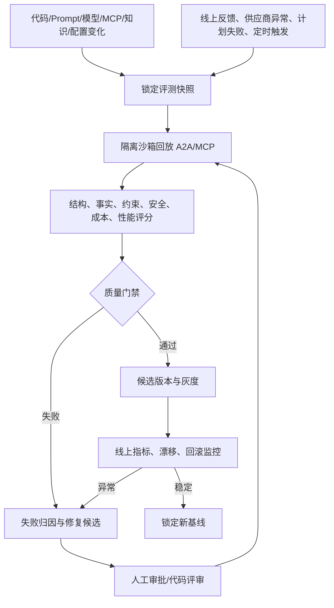
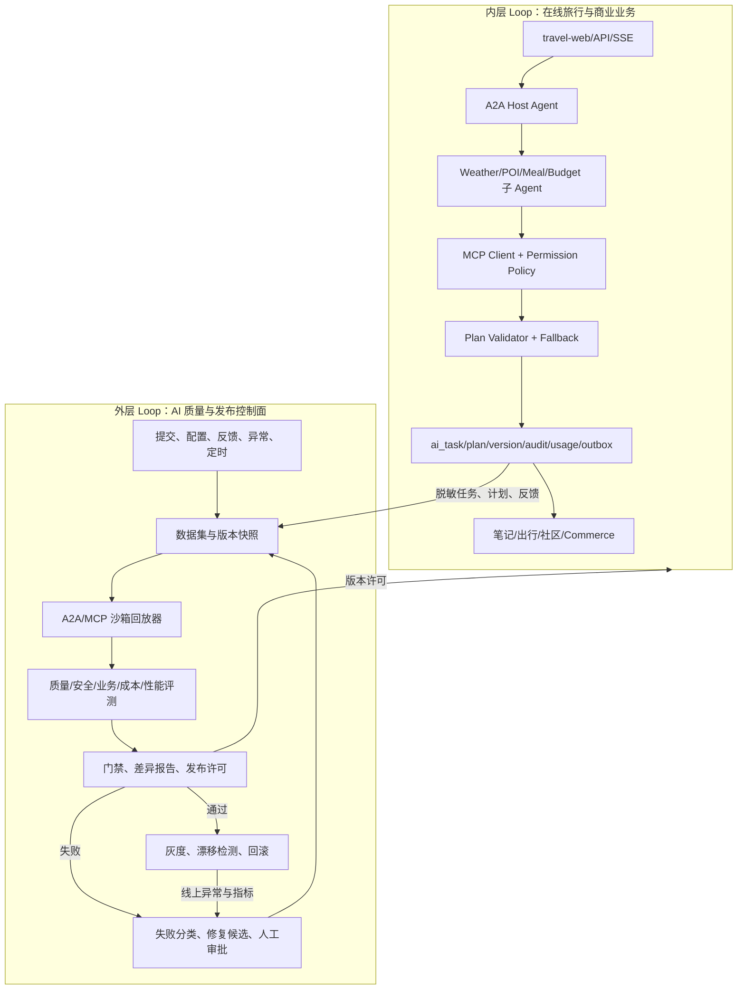

# Roamly 双层 Loop 企业级 AI 应用架构 PRD

> 文档类型：架构与产品设计 PRD  
> 适用项目：`travel-agent`  
> 文档版本：v1.0  
> 编写日期：2026-09-27  
> 状态：设计方案，外层 Loop 尚未实现

## 1. 结论摘要

Roamly 已经形成较完整的 **内层 AI 业务 Loop**：

```text
旅行需求
  → 问卷/对话理解
  → A2A Host 编排子 Agent
  → MCP 天气/POI/餐饮/预算工具
  → 计划结构校验与确定性兜底
  → ai_task/ai_plan/ai_plan_version 持久化
  → SSE 增量返回与断线重放
  → 用户保存、出行生命周期、社区内容和商业订单
  → 审计、用量、Outbox、支付事件和权益结果
```

当前代码还没有完整的 **外层质量 Loop**。缺少独立的评测控制平面来持续完成：版本快照、脱敏样例回放、MCP/A2A 契约检查、计划事实性和约束检查、业务结果比较、发布门禁、灰度监控、回滚和修复后再验证。

| 层次 | 当前判断 | 说明 |
|---|---|---|
| 单次旅行规划内层 Loop | 已形成较强骨架 | 有 A2A/MCP 编排、计划持久化、校验、SSE 重放和商业关联 |
| 项目级外层 Loop | 尚未形成 | 没有自动回归编排、数据集版本、基线比较、修复控制和发布门禁 |
| 企业生产闭环 | 尚未完成 | 企业迁移、真实 MySQL/Redis/MCP/AI/支付、E2E、压测和恢复仍待目标环境 |

本 PRD 设计的外层 Loop 不是“让模型自己修改项目”。它是一个使用 Java 调度、数据库状态机、沙箱凭证和质量门禁构建的控制面。模型可以帮助归因和提出 Prompt/规则/代码修复建议，但生产发布必须经过测试、评审、审批和可回滚部署。

## 2. 双层 Loop 的定义

### 2.1 内层 Loop：旅行规划与交付闭环

内层 Loop 关注一次用户需求是否安全地变成可使用、可保存、可继续演进的旅行计划。


内层 Loop 的关键不变量：

1. LLM 不直接操作数据库、支付或社区发布；业务服务决定状态和权限。
2. MCP 工具必须经过客户端协议、工具权限和参数校验。
3. 计划输出必须满足天数、预算、日期、目的地和结构约束；供应商失败要显式产生 `DataWarning`。
4. 任务、计划版本、审计、用量和事件可以通过 `planId`、`taskId`、`traceId` 关联。
5. SSE 重连读取已落库版本，不重复调用模型，不重复产生商业或内容副作用。

### 2.2 外层 Loop：持续回归与发布控制

外层 Loop 关注“新的代码、模型、Prompt、MCP 工具或数据是否破坏了计划质量和业务安全”。



## 3. 为什么 Roamly 适合增加外层 Loop

当前架构已经提供了外层 Loop 的观测基础：

| 已有能力 | 外层 Loop 可复用的证据 |
|---|---|
| `ai_task` | 任务输入、状态、进度、尝试次数、输出和错误 |
| `ai_plan` / `ai_plan_version` | 不可变计划版本、模型、Prompt、质量状态和警告 |
| `ai_audit_event` | 状态变化和敏感操作审计 |
| `ai_usage_ledger` | 供应商、模型、延迟和费用字段 |
| `ai_outbox_event` | 计划创建、通知、商业归因和运营分析事件 |
| A2A Host/Orchestrator | 可替换的沙箱编排入口 |
| MCP Tool Permission Policy | 工具白名单和越权断言 |
| `ItineraryPlanValidator` | 计划结构、天数和字段质量断言 |
| Commerce 幂等与沙箱支付 | 可隔离验证订单、支付事件和权益 |

需要补的是一个独立的控制面，而不是再增加一个用户侧 Agent。

## 4. 目标架构



### 4.1 运行隔离

- 外层评测使用独立数据库 schema、Redis namespace、MCP endpoint 和 AI Provider 凭证。
- 评测默认不访问生产用户数据；线上样例必须脱敏并通过快照审批。
- 默认只执行只读 MCP 工具。需要验证保存、订单或支付时，使用虚拟用户、虚拟计划、沙箱支付和可清理租户。
- 评测身份由服务端绑定，不允许测试请求通过 `userId`、`planId` 或 `tenantId` 越权。
- 外层 Loop 无权直接改生产 Prompt、路由、模型或代码，只能生成候选版本和门禁结果。

## 5. 外层 Loop 功能需求

### P0：不可变快照与可重复回放

每一次 `evaluationRun` 必须固定：

- Git commit、构建产物和运行配置；
- Prompt、模型、A2A 子 Agent、MCP Server、工具 Schema 和权限策略版本；
- `ai_task`/计划输入的脱敏快照和评测数据集哈希；
- 目标城市、日期、天数、预算、人数、偏好、时区和语言；
- 外部数据的录制响应或固定 fixture，避免天气和 POI 实时变化污染回归；
- 随机种子、最大步骤、最大 Token、超时、并发和总预算。

同一快照重复执行时，必须能区分实时供应商差异、LLM 非确定性和代码版本变化。原始 Prompt、地理位置、联系方式和计划内容按敏感等级脱敏、加密并设置保留期。

### P0：协议、安全和资源归属门禁

逐条检查：

1. MCP JSON-RPC、SSE、A2A 事件和错误码符合契约；
2. 工具调用属于允许集合，参数满足 Schema，禁止任意网络和 SQL；
3. 任务、计划、笔记、社区内容和订单只能由所属用户/角色访问；
4. Prompt Injection、恶意 POI 文本、网页内容和 MCP 返回值不能改变工具权限；
5. 取消、超时、重连和重复提交不会重复调用模型或写入业务状态；
6. 沙箱评测不会触发真实支付、退款、通知、发布或联盟回调；
7. 输出不泄露 Token、供应商密钥、内部 URL、个人信息或异常堆栈。

安全门禁失败必须阻断候选版本，不能用旅行计划质量平均分抵消。

### P1：计划质量和事实性门禁

每个计划至少检查：

- 目的地、出行天数和每日计划数量一致；
- 每个景点、餐饮和路线有真实 MCP 结果、录制来源或明确的待确认告警；
- 供应商失败不生成看似真实的名称、价格、距离和营业时间；
- 预算估算有来源或明确标为估算，不能把缺失价格当成免费；
- 行程时间、日期、时区和路线顺序满足约束；
- 用户偏好、预算、人数和出行节奏被正确保留；
- LLM 输出不可用时，确定性兜底计划仍满足最低结构和告警要求；
- 计划版本、模型、Prompt、工具、警告和质量状态可以完整还原。

### P1：业务闭环门禁

| 指标 | 说明 | 门禁规则 |
|---|---|---|
| 结构校验通过率 | JSON/领域规则/计划版本均可落库 | 不得低于基线 |
| 事实来源覆盖率 | 景点、餐饮、天气、预算事实有来源 | 低于阈值阻断 |
| 约束满足率 | 天数、预算、日期、偏好和路线约束 | 关键约束失败即阻断 |
| MCP 越权率 | 工具策略禁止的调用比例 | 必须为 0 |
| 重复副作用率 | 重连/重试造成重复保存、订单、支付或权益 | 必须为 0 |
| 计划保存率 | 生成后保存为笔记/行程的比例 | 趋势和灰度信号 |
| 商业转化率 | 点击、建单、支付、权益完成 | 需区分沙箱与真实支付 |
| 单计划成本 | Token/供应商费用/有效计划数 | 超预算触发降级或阻断 |
| P95 生成耗时 | 首屏事件、完成事件和重放耗时 | 超 SLO 进入修复队列 |

离线门禁应优先保证安全、事实和约束，不能用商业转化率掩盖安全失败。

### P1：失败归因和修复候选

失败分类包括：

- A2A/MCP 协议或 Schema 错误；
- 子 Agent 选择、并行编排或参数错误；
- 供应商结果缺失、过期、污染或不可复现；
- Prompt/模型解析失败、幻觉或计划约束不满足；
- 任务持久化、SSE 重放、幂等或状态机错误；
- 用户/计划/笔记/订单归属权限错误；
- 成本、延迟、并发、队列和资源问题；
- 迁移、配置、部署和外部依赖问题。

修复候选可包含 Prompt、工具 Schema、fixture、数据规则、Java 代码、SQL 迁移和配置变更。任何候选修复必须在原失败集、全量回归集和安全集上重新运行，并保留修复前后的差异。

### P2：灰度、漂移和回滚

- 通过离线门禁的版本只获得候选资格；
- 按用户、目的地、流量或租户灰度；
- 监控计划失败、来源覆盖、降级、重连、延迟、成本、投诉和商业副作用；
- 出现安全事件、来源覆盖骤降、重复副作用、成本突增或 SLO 连续失败时自动回滚；
- 回滚必须同时绑定代码、Prompt、模型、MCP、工具策略和知识版本。

## 6. 建议数据模型

在现有 `ai_task`、`ai_plan`、`ai_plan_version`、`ai_audit_event`、`ai_usage_ledger` 和 `ai_outbox_event` 之外，建议增加：

| 实体 | 关键字段 | 作用 |
|---|---|---|
| `ai_eval_dataset` | 版本、哈希、场景、fixture、脱敏策略 | 固定旅行样例、工具响应和约束 |
| `ai_eval_run` | 运行 ID、基线/候选版本、触发源、状态、预算 | 一次外层 Loop 运行 |
| `ai_eval_case_result` | 样例、计划摘要、工具轨迹、断言、得分、错误分类 | 逐条结果与差异 |
| `ai_quality_gate` | 门禁类型、阈值、实际值、结论、审批人 | 发布许可依据 |
| `ai_repair_attempt` | 失败聚类、修复工件、审批、回放结果 | 修复闭环 |
| `ai_release_baseline` | 代码、Prompt、模型、MCP、工具、数据版本和指标 | 可比较和回滚基线 |
| `ai_feedback_event` | 评分、投诉、保存/完成结果、人工标签 | 线上反馈回流 |

建议所有控制面实体都记录环境、用户/租户边界、创建人、时间、幂等键和审计链。计划正文和地理信息应支持加密、脱敏和按保留期限删除。

## 7. 运行状态机

```text
CREATED
  → SNAPSHOT_LOCKED
  → REPLAYING
  → SCORING
  → GATED
       ├─ PASSED → CANDIDATE → CANARY → BASELINE
       ├─ FAILED → TRIAGED → REPAIR_PENDING
       │                    ├─ APPROVED → REPLAYING
       │                    └─ REJECTED → CLOSED
       └─ ABORTED
```

规则：

- 相同候选版本、数据集哈希和环境只能有一个活动运行；
- 评测超时、fixture 缺失或依赖不可用进入 `ABORTED`，不能记为通过；
- 门禁决定只追加不覆盖；
- 修复循环有最大次数、最大 Token、最大金额和总时长；
- 连续失败或安全失败转人工，不允许无限自动循环。

## 8. Roamly 具体评测集

### 旅行规划样例

- 北京/上海等目的地的 1、3、7 日行程；
- 预算紧张、多人、亲子、无障碍、雨天和兴趣偏好；
- 天气/MCP/POI/餐饮/预算服务部分失败；
- 价格缺失、距离不可信、营业时间冲突和日期跨时区；
- LLM 输出 Markdown、JSON 不完整或包含未知景点时的确定性兜底；
- 同一 `taskId` 重试、SSE 断线、取消后重连不能重复规划；
- 计划保存、版本修改、出行状态流转和恢复。

### 安全和内容治理样例

- Prompt 要求读取别人的计划、笔记或订单；
- 恶意景点文本要求调用支付、发布或内部工具；
- MCP 返回内容包含伪造系统指令；
- 用户复制社区内容后的版权预检、举报和审核状态；
- 无 Token、错误角色、跨用户、跨计划和跨租户访问。

### 商业化样例

- 商品点击归因、幂等建单、沙箱支付、支付事件重复回调；
- 计划不属于当前用户时不能建单或支付；
- 支付失败、取消、权益写入和重试；
- 沙箱开关关闭时所有支付行为都被拒绝并产生审计事件。

每条样例应携带输入快照、期望工具集合、禁止工具集合、预期告警、约束、是否允许降级、预期状态和证据要求。

## 9. 实施计划

### Phase 0：建立基线（1 个迭代）

1. 固化代码、Prompt、模型、A2A、MCP、工具策略和数据版本格式。
2. 将旅行请求和录制的 MCP 响应制作成可审查的 fixture，计算数据集哈希。
3. 从 `ai_plan_version`、`ai_audit_event` 和 `ai_usage_ledger` 生成首个基线。
4. 明确开发、预发布、评测沙箱和生产的数据库、Redis、MCP、AI 凭证边界。

### Phase 1：离线外层 Loop MVP（1—2 个迭代）

1. 增加 `ai_eval_dataset`、`ai_eval_run`、`ai_eval_case_result`、`ai_quality_gate`。
2. 实现 `OuterLoopEvaluationJob`、`A2aReplayService`、`McpFixtureServer` 和 `QualityGateService`。
3. 使用沙箱任务和只读工具，支持断点、重试、取消和结果重放。
4. 先手动触发，再接入 CI；失败阻断候选镜像，不影响线上流量。

### Phase 2：反馈、归因和修复循环（2—3 个迭代）

1. 接入用户评分、计划保存/完成、投诉、供应商告警和人工审核标签。
2. 对 A2A/MCP/计划约束失败聚类，生成差异报告。
3. 生成 Prompt、工具 Schema、fixture、规则和 Java 修复候选。
4. 修复候选自动补充回归样例，重新跑安全集、全量集和资源归属集。

### Phase 3：发布门禁和灰度（2—3 个迭代）

1. CI/CD 顺序固定为：编译 → 单测 → 迁移校验 → 外层回归 → 镜像 → 部署。
2. 按用户/目的地/租户灰度 Prompt、模型、MCP 和工具策略。
3. 统一监控质量、事实来源、成本、延迟、SSE 重连、商业结果和安全事件。
4. 实现绑定全版本的自动回滚和基线锁定。

### Phase 4：企业运营闭环

1. 补齐组织/租户、RBAC、管理员、配额和成本分摊。
2. 建立数据保留、删除、导出、地理信息脱敏和密钥轮换流程。
3. 执行真实 MySQL/Redis/MCP/AI/支付环境的迁移、冒烟、压测和灾备演练。

## 10. 风险与漏洞清单

### 当前已知风险

1. 企业迁移和真实 MySQL/Redis/MCP/AI/支付尚未在目标环境完成，单测通过不能替代发布验收。
2. `TaskStateStore` 在数据库迁移未完成或数据库不可用时存在开发环境 Redis 降级路径；生产必须把数据库迁移成功和恢复能力作为前置条件。
3. 当前有结构校验和确定性兜底，但还没有系统化的事实来源覆盖门禁，模型生成的景点、价格和路线仍需外层回放验证。
4. `/api/travel/plan` 兼容接口已明确标记为未验证文本并限制输入长度；生产业务应统一迁移到 `/a2a/tasks` 或 `/api/travel-plans/generate`，避免把兼容接口结果当作可执行计划。
5. MCP 工具返回值和外部网页/地点文本是不可信输入，存在间接 Prompt Injection、数据污染和过期事实风险。
6. 现有身份边界主要是用户和资源归属；组织、租户、RBAC、管理员审核和配额尚不完整。
7. 部分旧接口仍需继续收口 `userId` 等身份参数；生产应以 Token 上下文为唯一事实源。
8. 计划、地理位置、社区内容、邮箱和模型输入可能含个人信息，需要脱敏、加密、删除和导出策略。
9. 沙箱支付只证明状态机和幂等，不证明真实支付验签、退款、对账和 webhook 安全。
10. 评测集规模有限，固定 MCP fixture 可能与线上世界漂移；必须同时做离线回放和线上漂移监控。

### 外层 Loop 新增风险

- 回放器误连生产 MCP、数据库或支付服务；
- 评测快照包含真实用户行程、地理位置或 Token；
- 只优化离线计划评分，却增加成本、延迟或供应商依赖；
- 自动修复循环反复改 Prompt，导致回归集过拟合；
- 灰度只切换模型而未绑定 MCP、工具策略、Prompt 和计划 Schema；
- 天气、POI、价格等动态数据造成不可重复的假失败。

控制措施包括独立凭证、网络白名单、MCP fixture、沙箱租户、不可变快照、预算/次数上限、人工审批和全版本回滚。

## 11. 验收标准

第一版外层 Loop 必须满足：

1. 任意代码、Prompt、模型、MCP、工具策略或计划 Schema 变化都能触发带哈希的运行。
2. A2A/MCP 回放可重复、可暂停、可恢复、可取消；依赖失败不会被记为通过。
3. 每条样例都有协议、安全、计划约束、来源、成本和业务结果断言。
4. 评测身份无法访问生产个人数据，不能产生真实订单、支付、发布、通知或权益副作用。
5. 跨用户/跨计划越权、禁止工具、重复副作用和确认前写入为零容忍。
6. 失败有分类、证据、基线差异和修复候选；修复后必须重跑全量安全集。
7. 通过版本可灰度、监控和回滚，并同时锁定代码、Prompt、模型、MCP、工具和数据版本。
8. 报告能回答：哪个计划、哪个工具、哪个外部结果、哪个版本导致失败，修复是否改善了线上指标。

## 12. 面试中的核心表达

可以这样介绍 Roamly：

> 我把旅行规划拆成两层 Loop。内层是 A2A Host 负责编排 MCP 子 Agent，经过计划 Schema、事实告警、持久化版本、SSE 重放和业务幂等，把用户需求闭环到可保存、可出行、可商业化的结果。外层是 Java 控制平面，对代码、Prompt、模型、MCP 和工具策略做不可变快照和沙箱回放，执行协议、安全、事实、约束、成本和性能门禁，失败后生成修复候选并重新回归，再通过灰度和回滚控制发布。

Java 面试重点展示：Spring 多模块边界、A2A/MCP 协议实现、任务状态机、MySQL 持久化、Redis 实时状态、SSE 重连、幂等、Outbox、线程池和超时、工具权限、数据归属、测试夹具、CI 门禁和故障恢复。核心竞争力是让 AI 的不确定输出进入可验证、可恢复和可发布的业务系统。

## 13. 当前发布判断

本 PRD 完成了双层 Loop 的架构设计和落地路线，但文档不代表外层控制面已经实现。当前应使用“内层 AI 业务闭环已具备，外层回归与发布控制面已完成设计，正在建设”的表述；完成 Phase 1、真实迁移和目标环境验收后，再称为具备双层 Loop 的企业级 AI 应用候选版本。

## 14. 当前无法在代码仓库内闭合的门禁（红色）

<div style="color:red">

以下项目依赖真实基础设施、动态供应商数据或产品/合规决策，当前不能仅靠本仓库安全地完成。它们必须在目标环境执行并保留验收证据：

1. **企业迁移与回滚**：需要按 `schema_clean.sql`、历史迁移和 `enterprise_ai_migration.sql` 顺序在一次性数据库执行，并验证旧数据、索引、重复执行和恢复；当前本机没有可用的 travel-agent 测试库。
2. **真实 MySQL、Redis、MCP Server 和 AI Provider 联调**：需要验证 A2A 任务恢复、SSE 重连、动态天气/POI、限流、超时、供应商降级和多实例一致性。
3. **动态事实的持续校验**：天气、POI、价格和营业时间随时间变化，仓库只能提供固定 fixture 和结构校验；事实新鲜度和线上漂移必须由外层 Loop 与真实数据源共同验证。
4. **真实支付、退款、webhook 和对账**：当前是沙箱适配器，真实资金链路需要供应商验签、退款、对账、风控和合规审批。
5. **组织/租户/RBAC 与管理员审核规则**：需要业务方确认组织层级、审核角色、配额和数据导出删除策略，代码不能替产品组织做最终授权决策。
6. **浏览器 E2E、压测、故障注入和灾备演练**：需要目标环境、容量目标、监控和演练窗口；不能用 Maven 测试替代。
7. **外层 Loop 的自动修复、CI 阻断、灰度和回滚服务**：当前已提供 PRD 设计和可生成验收证据的脚本，完整质量控制面仍需单独实现。

</div>
